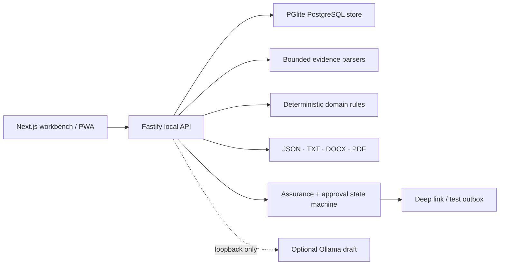

<p align="center">
  
</p>

<h1 align="center">Nimanto</h1>

<p align="center"><strong>Evidence first. Applications second.</strong></p>

<p align="center">
  A private, candidate-controlled job search and application workbench for H-1B professionals.<br>
  Build one verified career record, understand why a role fits, prepare grounded materials,<br>
  and approve every external handoff yourself.
</p>

<p align="center">
  <strong>Local-first</strong>&nbsp;&nbsp;·&nbsp;&nbsp;<strong>Explainable matching</strong>&nbsp;&nbsp;·&nbsp;&nbsp;<strong>No silent send</strong>
</p>

<p align="center">
  <a href="https://github.com/udhawan97/Nimanto/actions/workflows/ci.yml"></a>
  <a href="https://github.com/udhawan97/Nimanto/releases/latest"></a>
  
  
  
  
  <a href="LICENSE"></a>
</p>

<p align="center">
  <a href="https://udhawan97.github.io/Nimanto/"><strong>Website</strong></a>
  ·
  <a href="#run-the-local-beta"><strong>Run the beta</strong></a>
  ·
  <a href="http://127.0.0.1:4310/docs"><strong>Local API docs</strong></a>
  ·
  <a href="docs/planning/product-contract.md"><strong>Product contract</strong></a>
</p>

<p align="center">
  
</p>

## The simple version

A job search usually becomes a pile of resumes, saved roles, sponsorship rumors, application forms, and follow-up notes. Nimanto gives that work one inspectable path:

Its visual language pairs Japanese restraint and intentional space with Indian modernism—indigo, warm marigold, terracotta, and fine jaali geometry—without turning culture into decoration.

1. Import career evidence. Every extracted claim starts **pending**.
2. Confirm the claims you can support and save your exact work-authorization wording.
3. Add a role manually or refresh an allowlisted public Greenhouse, Lever, or Ashby board.
4. Run deterministic matching and inspect supported requirements, missing evidence, coverage, and blockers.
5. Track the application and generate shared JSON/TXT plus modern and ATS-safe DOCX/PDF materials from confirmed evidence.
6. Run assurance, approve the packet, approve the exact action, then enable the reset-on-restart execution switch.

Nimanto is a **candidate tool**. It does not screen candidates for employers, estimate hiring probability, provide legal advice, or promise that a company supports an H-1B transfer today.

## At a glance

| If you need to…                     | Start with                | What Nimanto keeps visible                                                                      |
| ----------------------------------- | ------------------------- | ----------------------------------------------------------------------------------------------- |
| Build a reusable career record      | **Evidence vault**        | Claim status, source name, source locator, confidence, and profile version                      |
| Decide whether a role is worth time | **Role discovery**        | Requirement-by-requirement evidence, coverage limits, blockers, and explicit exclusions         |
| Keep sponsorship context honest     | **H-1B evidence signals** | Source type, period, observation time, confidence, and limitations                              |
| Prepare application materials       | **Review packets**        | Canonical content, modern and ATS-safe variants, hashes, assurance findings, and approval state |
| Hand work to email safely           | **Approved actions**      | Exact recipient and payload, action approval, runtime switch, provider result, and receipt      |
| Leave with your data                | **Data controls**         | Portable workspace JSON with artifact manifests and a resumable, status-token deletion path     |

## What is implemented

### Evidence and matching

- Manual entry plus bounded UTF-8 TXT, Markdown, JSON, OOXML DOCX, text-layer PDF, and positive-allowlist LinkedIn archive import. Only Profile, Positions, Education, Skills, Certifications, and Projects CSV fields are previewed; messages, connections, contacts, advertising, and other files are structurally ignored. DOCX macros/embeddings, malformed or expanding archives, scans without a text layer, files over 8 MiB, and PDFs over 50 pages fail closed; every extracted claim stays pending until confirmed and raw uploads are discarded after extraction.
- Candidate confirmation before an imported claim can support a match or packet.
- Immutable profile versions with candidate-approved authorization wording.
- Deterministic `scoring_rules_v1` matching with four documented dimensions.
- Visible sponsorship, citizenship, clearance, and location blockers.
- A narrow, documented free-text scoring projection removes pronouns, standalone year cues, and a conventional name prefix before an em dash. The beta does not claim comprehensive de-identification; sensitive identity details should not be imported as scoring evidence.

### Discovery and application memory

- Manual job intake and allowlisted Greenhouse, Lever, and Ashby provider adapters.
- Redirect refusal, fixed provider hosts, timeouts, and bounded imports.
- Disabled-by-default, terms-dated exact-host HTTPS intake with pinned public DNS, private-address/redirect rejection, and transient-body deletion.
- Historical H-1B evidence with source period, confidence, and limitations.
- Employer resolution is disabled by default. Positive upgrades require a server-owned independently reviewed corpus with at least 300 unique predicted-positive fixtures, 0.98 measured precision, and a 0.95 Wilson 95% lower bound; the report also exposes recall, abstention, false positives, and denominators.
- Application states and candidate-recorded replies, screens, interviews, offers, rejections, and withdrawals.

### Grounded packets

- Deterministic packet assembly from confirmed evidence only.
- Shared JSON/plain text plus synchronized modern and conservative ATS-safe DOCX/PDF variants with SHA-256 hashes.
- `application_assurance_v1` checks for unsupported claims, authorization-wording drift, missing destinations, duplicates, and prohibited outcome promises.
- `document_assurance_v1` checks artifact names/hashes, canonical JSON, critical-text extraction across all five readable formats, Letter page size/count, blank pages, PDF metadata, and modern/ATS parity.
- Optional Ollama draft endpoint on `127.0.0.1:11434`; output stays labeled **unverified local draft** and never edits a packet automatically.
- Optional exact-tag `NIMANTO_ASSURANCE_MODEL`; when configured, its installed digest is recorded and unavailable/malformed/blocking local review fails approval closed without cloud fallback.

### Approval-gated actions

- Email deep-link and local test-outbox providers.
- Separate packet approval, action approval, and in-memory execution switch.
- The switch always starts **off** after an API restart.
- Idempotency keys, explicit action states, local receipts, and safe failure codes.

## Run the local beta

### One double-click on macOS

Clone or download the repository, then open `START-NIMANTO.command`. It installs the locked workspace dependencies, starts the local services, and opens the workbench.

### Terminal

Requirements: Node.js 24–26, pnpm 11, and macOS, Linux, or Windows.

```bash
git clone https://github.com/udhawan97/Nimanto.git
cd Nimanto
corepack enable
pnpm install --frozen-lockfile
pnpm dev
```

Open the private workspace URL printed by the API; it carries a local launch key in the URL fragment and removes that fragment immediately after loading. The API and its OpenAPI explorer are at [http://127.0.0.1:4310/docs](http://127.0.0.1:4310/docs).

Data is stored under `.nimanto-data/` unless `NIMANTO_DATA_DIR` says otherwise. The starter workspace is synthetic and labeled.

For invite-only self-hosting, `docker compose up --build` runs the same beta with demo login disabled and a named private data volume. See the [local operations guide](docs/operations/local-beta.md#private-invitations) to issue a hashed, expiring, single-use invitation.

## Provider setup

| Provider    | Beta capability              | Extra setup                               | Can verification send?          |
| ----------- | ---------------------------- | ----------------------------------------- | ------------------------------- |
| Deep link   | Prepares a `mailto:` handoff | None                                      | No                              |
| Test outbox | Writes a local JSON message  | Turn on the runtime switch after approval | Only to `.nimanto-data/outbox/` |

Connected-account sending is not present in v0.1.0. See [provider boundaries](docs/operations/provider-setup.md) for the separately gated Slice 4 direction.

## Architecture



The monorepo keeps the deep seams separate:

- `packages/domain` — matching, assurance, receipts, and action state transitions.
- `packages/database` — tenant-scoped Postgres schema and repository boundary.
- `packages/parsers` — bounded evidence extraction.
- `packages/documents` — canonical packet rendering.
- `packages/providers` — job sources, local model, deep-link, and local test-outbox adapters.
- `apps/api` — authenticated HTTP composition root and OpenAPI surface.
- `apps/worker` — optional bounded public-board refresh loop.
- `apps/web` — public website and non-technical local workbench.

Read the [system architecture](docs/architecture/system.md), [trust and security model](docs/planning/trust-and-security.md), or generated [Graphify report](graphify-out/GRAPH_REPORT.md).

## Verify it

```bash
pnpm check
pnpm build
pnpm test:e2e
```

The current suite covers private launch access, tenant isolation, owner-only filesystem modes, deterministic matching and freshness, canonical receipts, parser boundaries, provider allowlists, modern/ATS-safe packet formats, artifact tamper detection, assurance gating, resumable deletion, external-action transitions, API integration, WebKit rendering, and the worker's bounded idle behavior.

## Beta boundaries

Version `0.1.0` is a **local beta**:

- The local candidate workflow is implemented and tested.
- Public website hosting contains product information and static workbench code; it does not host a candidate backend.
- Desktop packaging, signing, notarization, and updates are not release surfaces in v0.1.0.
- Gmail, Outlook, form submission, and other connected external effects remain outside this release and require the separately reviewed Slice 4 approval.
- Single-use, email-bound 72-hour invitations are implemented for local/self-hosted multi-user testing. Passkeys, hosted production row-level security, legal review, signed installers, updates, backups, and disaster recovery remain release gates.
- Sponsorship evidence is historical and role-specific. Verify the current posting and ask the employer.

## Privacy and safety

- No analytics or application telemetry is included.
- Sessions store only a SHA-256 token hash.
- Tenant IDs scope every product query, and cross-tenant tests exercise the public seam.
- External action payloads cannot execute from draft or pending states.
- The runtime switch is in memory and resets off.
- Exports are portable workspace JSON with identity, provenance, hashes, and artifact manifests; generated packet files download separately. Local deletion removes tenant rows, packet artifacts, local outbox messages, and the session.

Report a vulnerability through [GitHub private vulnerability reporting](https://github.com/udhawan97/Nimanto/security/advisories/new), not a public issue. See [SECURITY.md](SECURITY.md).

## Contributing

Start with [CONTRIBUTING.md](CONTRIBUTING.md), the [product contract](docs/planning/product-contract.md), and the [source/license ledger](docs/planning/sources-and-licenses.md). Changes that weaken candidate control, provenance, tenant isolation, or approval gates are out of scope.

## License

Apache License 2.0. See [LICENSE](LICENSE), [NOTICE](NOTICE), [ACKNOWLEDGMENTS.md](ACKNOWLEDGMENTS.md), [THIRD_PARTY_NOTICES.md](THIRD_PARTY_NOTICES.md), and the release [CycloneDX](docs/releases/nimanto-v0.1.0.cdx.json) / [SPDX](docs/releases/nimanto-v0.1.0.spdx.json) inventories.
