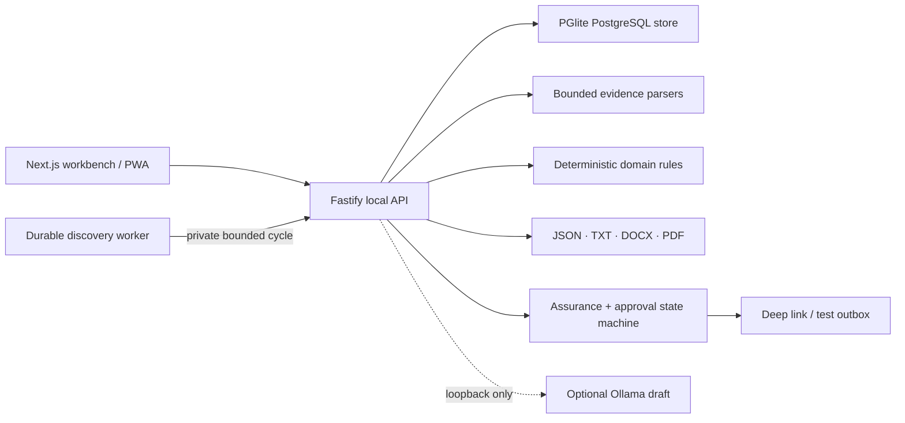

<p align="center">
  
</p>

<h1 align="center">Nimanto</h1>

<p align="center"><strong>Evidence first. Applications second.</strong></p>

<p align="center">
  A private, local-first job-search workbench for H-1B professionals.<br>
  Build one verified career record, see exactly why a role fits, and approve<br>
  every handoff yourself. Nothing leaves your machine unless you send it.
</p>

<p align="center">
  <a href="https://github.com/udhawan97/Nimanto/actions/workflows/ci.yml"></a>
  <a href="https://github.com/udhawan97/Nimanto/releases/latest"></a>
  
  
  
  
  <a href="LICENSE"></a>
</p>

<p align="center">
  <a href="https://udhawan97.github.io/Nimanto/"><strong>Website</strong></a>
  ·
  <a href="#run-it"><strong>Run it</strong></a>
  ·
  <a href="#what-it-actually-does"><strong>What it does</strong></a>
  ·
  <a href="docs/planning/product-contract.md"><strong>Product contract</strong></a>
</p>

<p align="center">
  
</p>

---

## The short version

A job search turns into a pile of resumes, saved roles, sponsorship rumours and
half-finished forms. Nimanto gives that work one inspectable path:

1. **Import** career evidence. Every extracted claim starts **pending**.
2. **Confirm** the claims you can actually support, and save your exact
   work-authorization wording.
3. **Add a role** by hand, or refresh an allowlisted Greenhouse, Lever or Ashby
   board.
4. **Match** deterministically, and read the requirement-by-requirement result:
   what is supported, what is missing, and what blocks you.
5. **Track** the application and generate JSON, plain text, and paired modern and
   ATS-safe DOCX/PDF from confirmed evidence only.
6. **Approve** — assurance, then the packet, then the exact action, then a runtime
   switch that resets itself off.

Nimanto is a **candidate tool**. It does not screen you for employers, estimate
your hiring odds, give legal advice, or promise that a company sponsors transfers
today.

## What it actually does

| If you need to…                     | Start with                | What stays visible                                                          |
| ----------------------------------- | ------------------------- | --------------------------------------------------------------------------- |
| Build a reusable career record      | **Evidence vault**        | Claim status, source name, source locator, confidence, profile version      |
| Decide whether a role is worth time | **Role discovery**        | Ephemeral filters, four match dimensions, requirements, coverage, blockers  |
| Keep sponsorship context honest     | **H-1B evidence signals** | Source, period, observation time, confidence, freshness adjustment, limits  |
| Remember what actually happened     | **Applications**          | Candidate-recorded outcomes and notes on a literal chronology               |
| Prepare application materials       | **Review packets**        | Canonical content, format checks, hashes, stored assurance findings         |
| Hand work to email safely           | **Approved actions**      | Exact recipient and payload, approval, runtime switch, provider receipt     |
| Inspect local provenance            | **Local activity**        | Hash-checked match, packet, and executed-action receipts; no delivery claim |
| Leave with your data                | **Data controls**         | Portable workspace JSON, artifact manifests, resumable deletion             |

## How it looks

Nimanto's visual system is **Colour & Material 002**, sampled from the emblem
rather than chosen beside it: ink, lacquer, ivory stone, aged brass, a deep
emerald seed, and one vermilion light. The proportion is a rule rather than a
suggestion — ink 74, stone 16, brass 7, vermilion 2, emerald 1. Brass is a line
weight and never a fill; vermilion earns its place once per screen.

The mark is a fold lotus: five brass-edged petals opening about a single axis,
two ivory outer and three lacquer inner, with the emerald seed at the centre and
the vermilion light behind it. It is the product's thesis as an object —
something that opens because you opened it.

<p align="center">
  
</p>

## Run it

### One double-click on macOS

Clone or download the repository, then open `START-NIMANTO.command`. It installs
the locked dependencies, starts the local services, and opens the workbench.

### Terminal

Requirements: Node.js 24–26, pnpm 11, and macOS, Linux or Windows.

```bash
git clone https://github.com/udhawan97/Nimanto.git
cd Nimanto
corepack enable
pnpm install --frozen-lockfile
pnpm dev
```

Open the private workspace URL the API prints. It carries a local launch key in
the URL fragment and strips that fragment immediately after loading. The API and
its OpenAPI explorer are at `http://127.0.0.1:4310/docs`.

Data lives under `.nimanto-data/` unless `NIMANTO_DATA_DIR` says otherwise. The
starter workspace is synthetic and labeled as such.

For invite-only self-hosting, `docker compose up --build` runs the same beta with
demo login disabled and a named private volume. See the
[local operations guide](docs/operations/local-beta.md#private-invitations) to
issue a hashed, expiring, single-use invitation.

## What is implemented

### Evidence and matching

- Manual entry, plus bounded import of UTF-8 TXT, Markdown, JSON, OOXML DOCX,
  text-layer PDF, and positive-allowlist LinkedIn archives.
- From a LinkedIn archive only Profile, Positions, Education, Skills,
  Certifications and Projects are previewed. Messages, connections, contacts and
  advertising data are structurally ignored.
- Fails closed on DOCX macros and embedded objects, malformed or expanding
  archives, scans with no text layer, files over 8 MiB, and PDFs over 50 pages.
  Raw uploads are discarded after extraction.
- Every extracted claim stays **pending** until you confirm it. Confirmation is
  required before a claim can support a match or a packet. The import preview
  lists the claims a file would create — up to the 500 an import stores —
  before anything is written.
- Immutable profile versions carrying candidate-approved authorization wording.
- Deterministic `scoring_rules_v1` matching across four documented dimensions,
  with sponsorship, citizenship, clearance and location blockers left visible.
- An unmet requirement offers to add evidence for itself. Only the requirement
  wording is carried into the claim form — never the posting's source name or
  locator — and the claim it creates is pending and user-attested like any other.
- Match anatomy exposes the four weighted dimensions, requirement states,
  evidence-link counts, coverage, rule version, exclusions and explicit
  blockers. Evidence Strength remains an API-level ordinal intentionally
  excluded from that view; the workbench does not turn it into a score or hiring
  probability. Manually entered claims are always attested, so a workspace built
  from them reports `source_limited`, including the synthetic starter data.
- The free-text scoring projection removes pronouns, standalone year cues and a
  conventional name prefix. It is **not** comprehensive de-identification —
  sensitive identity details should not be imported as scoring evidence.

### Discovery and application memory

- Manual job intake, plus allowlisted Greenhouse, Lever and Ashby adapters.
- Search by title, company or location and combine source, match-state, and
  tracking filters. These filters live only in the open Role discovery view;
  they are not persisted or sent to the API.
- Candidate-controlled hourly-to-weekly discovery schedules with single leases,
  run-now/pause/resume/cancel, bounded retries, visible dead letters,
  deduplication, and deterministic match receipts.
- Redirect refusal, fixed provider hosts, timeouts, bounded imports.
- Disabled-by-default, terms-dated exact-host HTTPS intake with pinned public
  DNS, private-address and redirect rejection, and transient-body deletion.
- Historical H-1B evidence with source type, locator, period, observation time,
  confidence, explicit freshness, any downgraded original label, and stated
  limitations. Current role wording remains controlling.
- Employer resolution is off by default. Enabling positive upgrades requires a
  server-owned, independently reviewed corpus of at least 300 unique
  predicted-positive fixtures at 0.98 measured precision with a 0.95 Wilson lower
  bound; the report also exposes recall, abstention, false positives and
  denominators.
- A five-stage application pipeline with candidate-recorded replies, screens,
  interviews, offers, rejections and withdrawals. Every status control — board
  card or row list — offers only the moves the domain allows, asks before a
  consequential one, and the transition is enforced server-side regardless.
- A recorded-outcome timeline shows application creation and the candidate's
  dated notes in order. It does not reconstruct unrecorded stages or infer an
  outcome from silence.

### Grounded packets

- Deterministic assembly from confirmed evidence only.
- Shared JSON and plain text, plus synchronized modern and conservative ATS-safe
  DOCX/PDF variants with SHA-256 hashes.
- `application_assurance_v1` checks unsupported claims, authorization-wording
  drift, missing destinations, duplicates and prohibited outcome promises.
- `document_assurance_v1` checks artifact names and hashes, canonical JSON,
  critical-text extraction across all five readable formats, Letter page
  size and count, blank pages, PDF metadata, and modern/ATS parity.
- Optional Ollama draft endpoint on `127.0.0.1:11434`. Output stays labeled
  **unverified local draft** and never edits a packet on its own.
- Optional exact-tag `NIMANTO_ASSURANCE_MODEL`. When configured, its installed
  digest is recorded, and an unavailable, malformed or blocking local review
  fails approval closed with no cloud fallback.
- Expandable packet review shows canonical destination, summary, claims and
  authorization wording beside document inspection checks, artifact hashes, and
  the latest stored assurance rule and findings. These checks cover structure,
  integrity and configured rules—not claim truth, writing quality, employer
  acceptance or external delivery.

### Approval-gated actions

- Email deep-link and local test-outbox providers.
- Separate packet approval, action approval, and an in-memory execution switch.
- The switch always starts **off** after an API restart.
- Idempotency keys, explicit action states, local receipts, safe failure codes.
- A local activity ledger verifies each stored receipt hash on read and exposes
  its input, artifact and receipt hashes with copy controls. It is tamper-evident
  internal history, not a signature or an employer acknowledgment.

## Architecture



The monorepo keeps the deep seams separate:

- `packages/domain` — matching, assurance, receipts, and the application and
  external-action state machines.
- `packages/database` — tenant-scoped Postgres schema and repository boundary.
- `packages/parsers` — bounded evidence extraction.
- `packages/documents` — canonical packet rendering.
- `packages/providers` — job sources, local model, deep-link and test-outbox
  adapters.
- `apps/api` — authenticated HTTP composition root and OpenAPI surface.
- `apps/worker` — durable, leased board refresh and deterministic scoring loop.
- `apps/web` — public website and the local workbench.

Read the [system architecture](docs/architecture/system.md), the
[trust and security model](docs/planning/trust-and-security.md), or the generated
[Graphify report](graphify-out/GRAPH_REPORT.md).

## Verify it

```bash
pnpm check
pnpm build
pnpm test:e2e
```

The suite covers private launch access, tenant isolation, owner-only filesystem
modes, deterministic matching and freshness, canonical receipts, parser
boundaries, provider allowlists, durable schedule leases, retries and dead
letters, application transition legality, modern and ATS-safe packet formats,
artifact tamper detection, assurance gating, resumable deletion, external-action
transitions, design-token contrast, API integration, and a WebKit journey.

## Beta boundaries

Version `0.3.0` is a **local beta**:

- The local candidate workflow is implemented and tested.
- Public website hosting carries product information and the static workbench
  code. It does not host a candidate backend.
- Desktop packaging, signing, notarization and updates are not release surfaces.
- Gmail, Outlook, form submission and other connected external effects remain
  outside this release, behind the separately reviewed Slice 4 approval.
- Single-use, email-bound 72-hour invitations are implemented for local and
  self-hosted multi-user testing. Passkeys, hosted production row-level security,
  legal review, signed installers, updates, backups and disaster recovery remain
  release gates.
- Sponsorship evidence is historical and role-specific. Verify the current
  posting, and ask the employer.
- The interface is dark only. The palette defines no light ground, and every
  contrast ratio in it is computed against ink.

## Privacy and safety

- No analytics and no application telemetry.
- Sessions store only a SHA-256 token hash.
- Tenant IDs scope every product query; cross-tenant tests exercise the seam.
- External action payloads cannot execute from draft or pending states.
- The runtime switch is in memory and resets off.
- Exports are portable workspace JSON with identity, provenance, hashes and
  artifact manifests. Generated packet files download separately. Local deletion
  removes tenant rows, packet artifacts, outbox messages and the session.
- Deletion hands back a seven-day status token and says which outcome it
  reached. If local file cleanup could not finish, it says so rather than
  reporting success, and the token resumes it. The token is a bearer
  capability — it reaches the status and resume routes without a session.
- The workbench re-checks the local API on its own, so the connection indicator
  cannot keep reporting "connected" after the service stops.

Report a vulnerability through
[GitHub private vulnerability reporting](https://github.com/udhawan97/Nimanto/security/advisories/new),
not a public issue. See [SECURITY.md](SECURITY.md).

## Contributing

Start with [CONTRIBUTING.md](CONTRIBUTING.md), the
[product contract](docs/planning/product-contract.md), and the
[source and license ledger](docs/planning/sources-and-licenses.md). Changes that
weaken candidate control, provenance, tenant isolation or approval gates are out
of scope.

## License

Apache License 2.0. See [LICENSE](LICENSE), [NOTICE](NOTICE),
[ACKNOWLEDGMENTS.md](ACKNOWLEDGMENTS.md),
[THIRD_PARTY_NOTICES.md](THIRD_PARTY_NOTICES.md), and the release
[CycloneDX](docs/releases/nimanto-v0.3.0.cdx.json) /
[SPDX](docs/releases/nimanto-v0.3.0.spdx.json) inventories.
