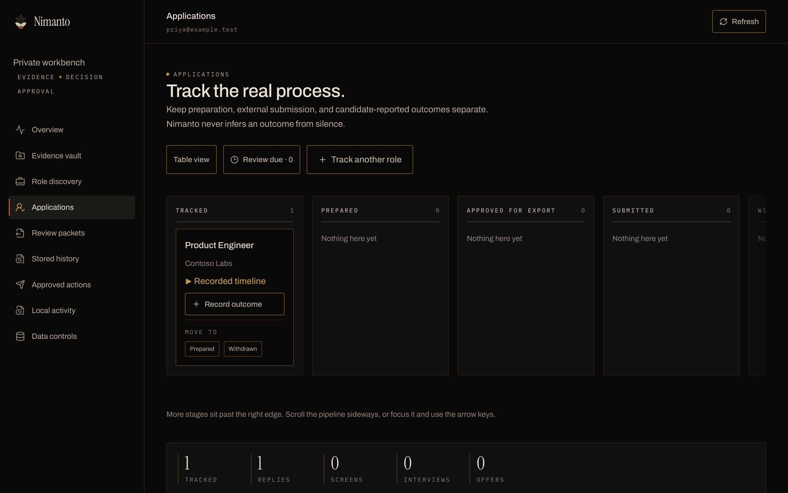
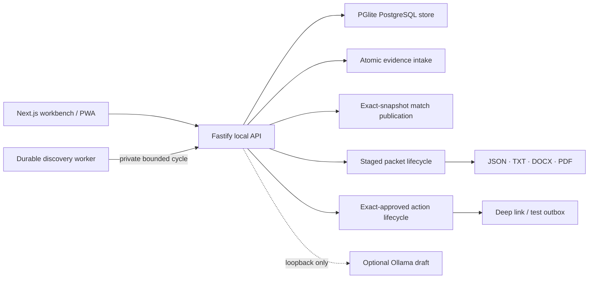

<p align="center">
  
</p>

<h1 align="center">Nimanto</h1>

<p align="center"><strong>Evidence first. Applications second.</strong></p>

<p align="center">
  A private, local-first job-search workbench for H-1B professionals.<br>
  Build one confirmed career record, see exactly why a role fits, work the<br>
  application record, and approve every handoff yourself.
</p>

<p align="center">
  <a href="https://github.com/udhawan97/Nimanto/actions/workflows/ci.yml"></a>
  <a href="https://github.com/udhawan97/Nimanto/releases/latest"></a>
  
  
  
  
  <a href="LICENSE"></a>
</p>

<p align="center">
  <a href="https://udhawan97.github.io/Nimanto/"><strong>Website</strong></a>
  ·
  <a href="#run-it"><strong>Run it</strong></a>
  ·
  <a href="https://github.com/udhawan97/Nimanto/releases/latest"><strong>Release &amp; checksums</strong></a>
  ·
  <a href="#what-it-actually-does"><strong>What it does</strong></a>
  ·
  <a href="docs/releases/v0.5.2.md"><strong>v0.5.2 notes</strong></a>
  ·
  <a href="docs/planning/product-contract.md"><strong>Product contract</strong></a>
</p>

<p align="center">
  
</p>

---

## The short version

A job search turns into a pile of resumes, saved roles, sponsorship rumours and
half-finished forms. Nimanto gives that work one inspectable path:

1. **Import** career evidence. Every extracted claim starts **pending**.
2. **Confirm** the claims you can actually support, and save your exact
   work-authorization wording.
3. **Add a role** by hand—with an in-tab draft that survives section changes—or
   refresh an allowlisted Greenhouse, Lever or Ashby board.
4. **Match** deterministically, and read the requirement-by-requirement result:
   what is supported, what is missing, and what blocks you.
5. **Track** the application from an action-first board or table, record only
   candidate-reported outcomes, and generate JSON, plain text, and paired modern
   and ATS-safe DOCX/PDF from confirmed evidence only.
6. **Inspect** retained profile, match, packet, and assurance records when you
   need them; compare literal stored values without inventing causality.
7. **Approve** — assurance, then the packet, then the exact action, then a runtime
   switch that resets itself off.

Nimanto is a **candidate tool**. It does not screen you for employers, estimate
your hiring odds, give legal advice, or promise that a company sponsors transfers
today.

## New in v0.5.2

- **Keyboard exits are explicit and reversible.** Escape cancels every shared
  in-product confirmation without committing its action, and focus returns to
  the control that opened it.
- **The mobile drawer owns its complete focus order.** Forward and reverse Tab
  move through every visible drawer control in DOM order and wrap at the ends,
  including the Brand-to-Close transition that platform WebKit handled
  inconsistently.
- **Approved packets stop explaining an obsolete gate.** Once approval succeeds,
  the Approve control no longer retains assurance-waiting copy or an obsolete
  `aria-describedby` relationship.
- **The public surface is current again.** The README, website, release paths,
  screenshots, dependency inventories, and operations guidance now describe one
  source-distributed `v0.5.2` beta with three explicit, bounded runtime paths.

## Previously in v0.5.1

- **The workbench stops stranding people.** Signing out no longer leaves an entry
  screen whose only two buttons are disabled with nothing saying why; the screen
  names the private launch key it needs and where the file lives. The gate itself
  is unchanged — the API enforces it too.
- **Consequential decisions ask in Nimanto's own words.** Status moves, discarding
  a role draft, and cancelling a schedule replaced `window.confirm` with an
  in-product confirmation whose buttons name the outcome. The prompts are
  unchanged; a browser dialog could only ever offer OK and Cancel, and a
  suppressed one turned the control into a silent no-op.
- **Rejecting a claim is labelled and asks once.** It is terminal in the store, so
  the screen now says so before and after, and the keep/discard pair is
  distinguishable without relying on colour.
- **Keyboard work keeps its place.** A successful action returns focus to the
  control that started it instead of dropping to the top of the document; the
  failure path still lands on the message it announced.
- **The application pipeline admits what it is hiding.** Below roughly 1560px the
  five stages are wider than the content column, so the board is a focusable
  region that states its hidden extent, and a card moved to a clipped stage is
  scrolled into view.
- **Typed characters stop disappearing.** Section focus is scheduled an animation
  frame after a section change and could land after you had started typing,
  swallowing the rest of the keystrokes. It now yields once focus is inside the
  section.
- **Throttling reports itself as throttling.** A rate-limit rejection returned
  `500 INTERNAL_ERROR`, including on `/health`, so the workbench told candidates
  their local service had failed and to restart a backend that was running. It
  now returns `429 RATE_LIMITED` with a wait-and-retry message, and the ceiling
  bounds a runaway loop rather than a person.

## New in v0.5.0

- **Application changes commit as one candidate decision.** The board and table
  read the same legal transition policy as the API. Consequential moves require
  an explicit server-checked confirmation, while the tenant-scoped transaction
  locks the current row and owns `submittedAt` stamping or clearing.
- **Packet work cannot rewrite candidate-recorded facts.** Generation and
  approval remain named system consequences for preparation, but preserve an
  existing external-submission or withdrawal status and its timestamp truth.
- **Every role route produces the same current-record shape.** Manual entry,
  allowlisted URLs, Greenhouse, Lever, and Ashby now share NFC/trim/default
  normalization after each adapter establishes its own identity, provenance, and
  content hash. This remains a mutable current Role—not immutable posting history
  or cross-source deduplication.
- **Workbench mutations settle predictably.** One UI-only coordinator sequences
  request, local commit, refresh, notice, and post-render focus. Authentication
  and credential cleanup stay in a separate Identity transition module;
  navigation, mobile focus, and sticky-header scrolling stay in their own module.

## What it actually does

| If you need to…                     | Start with                | What stays visible                                                          |
| ----------------------------------- | ------------------------- | --------------------------------------------------------------------------- |
| Build a reusable career record      | **Evidence vault**        | Claim status, source name, source locator, confidence, profile version      |
| Decide whether a role is worth time | **Role discovery**        | Ephemeral filters, four match dimensions, requirements, coverage, blockers  |
| Keep sponsorship context honest     | **H-1B evidence signals** | Source, period, observation time, confidence, freshness adjustment, limits  |
| Remember what actually happened     | **Applications**          | Action-first board/table, candidate-recorded outcomes, literal chronology   |
| Review a bounded application cohort | **Applications**          | Creation-window counts using current role source and match classification   |
| Prepare application materials       | **Review packets**        | Canonical content, format checks, hashes, stored assurance findings         |
| Compare retained records            | **Stored history**        | Profile diffs and same-role match runs, fetched only when opened            |
| Hand work to email safely           | **Approved actions**      | Exact recipient and payload, approval, runtime switch, provider receipt     |
| Inspect local provenance            | **Local activity**        | Hash-checked match, packet, and executed-action receipts; no delivery claim |
| Inspect or erase your data          | **Data controls**         | Sensitive workspace JSON, explicit exclusions, resumable deletion           |

## How it looks

Nimanto's visual system is **Colour & Material 002**, sampled from the emblem
rather than chosen beside it: ink, lacquer, ivory stone, aged brass, a deep
emerald seed, and one vermilion light. The proportion is a rule rather than a
suggestion — ink 74, stone 16, brass 7, vermilion 2, emerald 1. Brass is a line
weight and never a fill; vermilion earns its place once per screen.

The mark is a fold lotus: five brass-edged petals opening about a single axis,
two ivory outer and three lacquer inner, with the emerald seed at the centre and
the vermilion light behind it. It is the product's thesis as an object —
something that opens because you opened it.

<p align="center">
  
</p>

## Run it

Nimanto v0.5.2 is source-distributed. It does **not** ship a signed installer or
desktop binary.

| Runtime path       | Best for                          | Start here                                                      |
| ------------------ | --------------------------------- | --------------------------------------------------------------- |
| macOS launcher     | A local first run without a shell | Download or clone the source, then open `START-NIMANTO.command` |
| Terminal           | macOS, Linux, or Windows          | Node.js 24–26, pnpm 11, then the commands below                 |
| Docker on loopback | Invite-only local/self-hosted QA  | `docker compose up --build`; keep ports bound to `127.0.0.1`    |

Acquire the exact source from the pinned
[v0.5.2 release](https://github.com/udhawan97/Nimanto/releases/tag/v0.5.2); GitHub
generates its ZIP and tar archive from that tag.

### One double-click on macOS

Clone or download the repository, then open `START-NIMANTO.command`. It installs
the locked dependencies, starts the local services, and opens the workbench.

### Terminal

Requirements: Node.js 24–26, pnpm 11, and macOS, Linux or Windows.

```bash
git clone https://github.com/udhawan97/Nimanto.git
cd Nimanto
git checkout v0.5.2
corepack enable
pnpm install --frozen-lockfile
pnpm dev
```

Open the private workspace URL the API prints. It carries a local launch key in
the URL fragment and strips that fragment immediately after loading. The API and
its OpenAPI explorer are at `http://127.0.0.1:4310/docs`.

Data lives under `.nimanto-data/` unless `NIMANTO_DATA_DIR` says otherwise. The
starter workspace is synthetic and labeled as such.

For invite-only self-hosting, `docker compose up --build` runs the same beta with
demo login disabled and a named private volume. See the
[local operations guide](docs/operations/local-beta.md#private-invitations) to
issue a hashed, expiring, single-use invitation.

### Verify a source release

Every release publishes the two dependency inventories beside one checksum
manifest. After downloading the three `v0.5.2` assets into an empty directory,
verify both inventories before inspecting or building the source archive:

```bash
shasum -a 256 --check nimanto-v0.5.2-SHA256SUMS.txt
```

The manifest covers the CycloneDX and SPDX files. GitHub generates the source
ZIP and tar archive from the tag; those archives are not signed Nimanto desktop
artifacts.

## What is implemented

### Evidence and matching

- Manual entry, plus bounded import of UTF-8 TXT, Markdown, JSON, OOXML DOCX,
  text-layer PDF, and positive-allowlist LinkedIn archives.
- From a LinkedIn archive only Profile, Positions, Education, Skills,
  Certifications and Projects are previewed. Messages, connections, contacts and
  advertising data are structurally ignored.
- Fails closed on DOCX macros and embedded objects, malformed or expanding
  archives, scans with no text layer, files over 8 MiB, and PDFs over 50 pages.
  Raw uploads are discarded after extraction.
- Every extracted claim stays **pending** until you confirm it. Preview and
  import share one bounded projection and hash; changed content, deletion, or a
  failed batch writes no partial claim set. Confirmation is
  required before a claim can support a match or a packet. The import preview
  lists the claims a file would create — up to the 500 an import stores —
  before anything is written.
- Immutable profile versions carrying candidate-approved authorization wording.
  A normalized no-op save reuses the latest version instead of manufacturing a
  duplicate history row.
- Deterministic `scoring_rules_v1` matching across four documented dimensions,
  published against one exact profile version and job-content snapshot, with
  sponsorship, citizenship, clearance and location blockers left visible.
- An unmet requirement offers to add evidence for itself. Only the requirement
  wording is carried into the claim form — never the posting's source name or
  locator — and the claim it creates is pending and user-attested like any other.
- Match anatomy exposes the four weighted dimensions, requirement states,
  evidence-link counts, coverage, rule version, exclusions and explicit
  blockers. Evidence Strength remains an API-level ordinal intentionally
  excluded from that view; the workbench does not turn it into a score or hiring
  probability. Manually entered claims are always attested, so a workspace built
  from them reports `source_limited`, including the synthetic starter data.
- The free-text scoring projection removes pronouns, standalone year cues and a
  conventional name prefix. It is **not** comprehensive de-identification —
  sensitive identity details should not be imported as scoring evidence.

### Discovery and application memory

- Manual job intake, plus allowlisted URL, Greenhouse, Lever and Ashby adapters.
  All five paths share common current-Role normalization after source-specific
  retrieval, parsing, identity, provenance, and hashing.
- Manual role drafts stay in the signed-in browser tab across workbench section
  changes. Reload, sign-out, identity change, successful save, or confirmed
  discard clears them; failed saves preserve them.
- Search by title, company or location and combine source, match-state, and
  tracking filters. These filters live only in the open Role discovery view;
  they are not persisted or sent to the API.
- Candidate-controlled hourly-to-weekly discovery schedules with single leases,
  run-now/pause/resume/cancel, bounded retries, visible dead letters,
  deduplication, and deterministic match receipts.
- Redirect refusal, fixed provider hosts, timeouts, bounded imports.
- Disabled-by-default, terms-dated exact-host HTTPS intake with pinned public
  DNS, private-address and redirect rejection, and transient-body deletion.
- Checksum-addressed, idempotent government dataset editions with transformation
  version and trusted-resolution provenance. A conflicting checksum for the same
  source edition is rejected before any signal is written.
- Historical H-1B evidence with source type, locator, period, observation time,
  confidence, explicit freshness, any downgraded original label, and stated
  limitations. Current role wording remains controlling.
- Employer resolution is off by default. Enabling positive upgrades requires a
  server-owned, independently reviewed corpus of at least 300 unique
  predicted-positive fixtures at 0.98 measured precision with a 0.95 Wilson lower
  bound; the report also exposes recall, abstention, false positives and
  denominators.
- A five-stage application pipeline with candidate-recorded replies, screens,
  interviews, offers, rejections and withdrawals. Every status control — board
  card or row list — offers only the moves the domain allows, asks before a
  consequential one, and the API requires that confirmation again. Candidate
  read-policy-write and submission timestamps commit in one tenant-scoped
  transaction. Packet generation and approval remain separately named system
  consequences inside the Packet lifecycle; neither overwrites a
  candidate-recorded external submission or withdrawal.
- The actionable board/table surface precedes funnel, review-queue, and cohort
  analytics. Both views use the same labeled, deliberate outcome editor.
- A recorded-outcome timeline shows application creation and the candidate's
  dated notes in order. It does not reconstruct unrecorded stages or infer an
  outcome from silence.
- A record-review queue is derived from the newest application creation or
  candidate-recorded outcome timestamp. It appears after 336 elapsed hours,
  shows the exact activity baseline and computed due time in due order, excludes
  withdrawn records, persists no reminder, and infers no employer response.
- Application cohort counts use an explicit local-time creation window and
  optional current job-source/current match-classification filters. The
  classification contains the five domain bands plus separate unmatched and
  unknown buckets. Counts are mutually exclusive and raw—never rates,
  predictions, or reconstructed historical values.

### Retained history and comparison

- Cursor-paginated, tenant-scoped profile-version and match-run history is read
  only when **Stored history** opens. The dashboard remains bounded to current
  working records.
- Profile comparison reports exact added/removed claim IDs and exact
  authorization-wording changes. Neutral A/B labels stay truthful even when the
  candidate selects the same or reverse-ordered records. Same-role match
  comparison shows stored run, profile, rule, input-hash, result-hash, band, and
  blocker values beside a clearly labeled current mutable job snapshot.
- The stored match input hash covers the exact normalized job snapshot, profile
  input hash, claim IDs, and rule version. Comparisons still do not claim
  causality, replay guarantees, or immutable job history beyond that run.

### Grounded packets

- Deterministic assembly from confirmed evidence only.
- Shared JSON and plain text, plus synchronized modern and conservative ATS-safe
  DOCX/PDF variants with SHA-256 hashes.
- `application_assurance_v1` checks unsupported claims, authorization-wording
  drift, missing destinations, duplicates and prohibited outcome promises.
- `document_assurance_v1` checks artifact names and hashes, canonical JSON,
  critical-text extraction across all five readable formats, Letter page
  size and count, blank pages, PDF metadata, and modern/ATS parity.
- Optional Ollama draft endpoint on `127.0.0.1:11434`. Output stays labeled
  **unverified local draft** and never edits a packet on its own.
- Optional exact-tag `NIMANTO_ASSURANCE_MODEL`. When configured, its installed
  digest is recorded, and an unavailable, malformed or blocking local review
  fails approval closed with no cloud fallback.
- Expandable packet review shows canonical destination, summary, claims and
  authorization wording beside document inspection checks, artifact hashes, and
  the latest stored assurance rule and findings. These checks cover structure,
  integrity and configured rules—not claim truth, writing quality, employer
  acceptance or external delivery.
- Packet files render in a private staging directory. The database commit
  revalidates the exact application, profile, job and evidence inputs before the
  complete artifact set is promoted, so interrupted creation leaves no draft row
  with a partial manifest.
- A candidate can generate another unapproved packet for the same application,
  then inspect paginated generations and literal canonical-content differences.
  The view calls them history, not lineage: no predecessor relationship is
  stored. Packet status and manifests are identified as current mutable fields.
- Assurance history is paginated per packet and uses a packet-local ordinal. The
  database-wide ordering sequence is never returned to a candidate or export.

### Approval-gated actions

- Email deep-link and local test-outbox providers.
- Assurance records the exact packet-content and manifest hashes. Packet approval
  compare-and-swaps the latest passing assurance against those same frozen hashes.
- Separate packet approval, exact intent/packet binding at action approval, and an
  in-memory execution switch.
- The switch always starts **off** after an API restart.
- Idempotency keys, explicit action states, local receipts, safe failure codes,
  and an `ambiguous` terminal state when a provider effect may have succeeded but
  its local outcome could not be recorded. Ambiguous actions are never retried
  automatically.
- A local activity ledger verifies each stored receipt hash on read and exposes
  its input, artifact and receipt hashes with copy controls. It is tamper-evident
  internal history, not a signature or an employer acknowledgment.

## Architecture



The monorepo keeps the deep seams separate:

- `packages/domain` — matching, assurance, receipts, current-Role normalization,
  and the application and external-action state machines.
- `packages/database` — tenant-scoped Postgres schema and repository boundary.
- `packages/parsers` — bounded evidence extraction.
- `packages/documents` — canonical packet rendering.
- `packages/providers` — job sources, local model, deep-link and test-outbox
  adapters.
- `apps/api` — authenticated HTTP composition root plus cohesive evidence,
  publication, packet, action, discovery, deletion, and dataset lifecycles.
- `apps/worker` — durable, leased board refresh and deterministic scoring loop.
- `apps/web` — public website and the local workbench, with separate UI mutation,
  Identity, and navigation/focus transition modules.

Read the [system architecture](docs/architecture/system.md), the
[trust and security model](docs/planning/trust-and-security.md), or the generated
[Graphify report](graphify-out/GRAPH_REPORT.md).

## Verify it

```bash
pnpm check
pnpm build
pnpm test:e2e
pnpm release:check
pnpm screenshots:check
```

The suite covers private launch access, tenant-isolated history cursors,
owner-only filesystem
modes, deterministic matching and freshness, canonical receipts, parser
boundaries, provider allowlists, durable schedule leases, retries and dead
letters, application transition legality, modern and ATS-safe packet formats,
artifact tamper detection, assurance gating, resumable deletion, external-action
transitions, literal history comparison, sensitive export confirmation,
design-token contrast, API integration, and fifteen sequential WebKit journeys.

## Beta boundaries

Version `0.5.2` is a **local beta**:

- The local candidate workflow is implemented and tested.
- Public website hosting carries product information and the static workbench
  code. It does not host a candidate backend.
- Desktop packaging, signing, notarization and updates are not release surfaces.
- Gmail, Outlook, form submission and other connected external effects remain
  outside this release, behind the separately reviewed Slice 4 approval.
- Single-use, email-bound 72-hour invitations are implemented for local and
  self-hosted multi-user testing. Passkeys, hosted production row-level security,
  legal review, signed installers, updates, backups and disaster recovery remain
  release gates.
- Sponsorship evidence is historical and role-specific. Verify the current
  posting, and ask the employer.
- The interface is dark only. The palette defines no light ground, and every
  contrast ratio in it is computed against ink.

## Privacy and safety

- No analytics and no application telemetry.
- Sessions store only a SHA-256 token hash.
- Tenant IDs scope every product query; cross-tenant tests exercise the seam.
- Beginning workspace deletion locks the tenant, captures the outbox cleanup
  inventory, and fences every later tenant-owned insert or update.
- External action payloads cannot execute from draft or pending states.
- The runtime switch is in memory and resets off.
- Versioned inspection exports contain identity, provenance, hashes, packet
  manifests, dataset editions, and retained profile/match/assurance records. The workbench disables
  its download control until the candidate acknowledges the sensitive-data
  warning; the authenticated local API remains directly callable. Exports exclude
  sessions, invitation secrets, deletion internals, and generated packet files.
  The JSON is not a restore archive, immutable role history, or replay proof.
  Local deletion removes tenant rows, packet artifacts, outbox messages and the
  session.
- Deletion hands back a seven-day status token and says which outcome it
  reached. If local file cleanup could not finish, it says so rather than
  reporting success, and the token resumes it. The token is a bearer
  capability — it reaches the status and resume routes without a session.
- The workbench re-checks the local API on its own, so the connection indicator
  cannot keep reporting "connected" after the service stops.

Report a vulnerability through
[GitHub private vulnerability reporting](https://github.com/udhawan97/Nimanto/security/advisories/new),
not a public issue. See [SECURITY.md](SECURITY.md).

## Contributing

Start with [CONTRIBUTING.md](CONTRIBUTING.md), the
[product contract](docs/planning/product-contract.md), and the
[source and license ledger](docs/planning/sources-and-licenses.md). Changes that
weaken candidate control, provenance, tenant isolation or approval gates are out
of scope.

## License

Apache License 2.0. See [LICENSE](LICENSE), [NOTICE](NOTICE),
[ACKNOWLEDGMENTS.md](ACKNOWLEDGMENTS.md),
[THIRD_PARTY_NOTICES.md](THIRD_PARTY_NOTICES.md), and the release
[CycloneDX](docs/releases/nimanto-v0.5.2.cdx.json) /
[SPDX](docs/releases/nimanto-v0.5.2.spdx.json) inventories.
