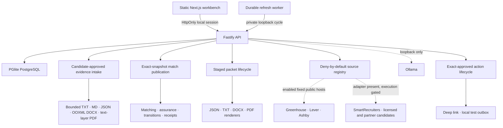

# Nimanto system architecture

## Purpose

Nimanto is a candidate-side evidence and application workbench. Its architecture keeps six trust boundaries explicit:

1. imported material is not confirmed evidence;
2. historical sponsorship evidence is not a current employer promise;
3. a current Role record is not immutable posting history;
4. a match explanation is not a hiring probability;
5. generated text is not an approved packet;
6. an approved packet is not permission to perform an external action.

## Runtime topology



The website is safe to publish as static files. It does not contain or host a shared candidate backend. A running local API at `127.0.0.1:4310` is required for the workbench.

## Data lifecycle

```mermaid
stateDiagram-v2
  [*] --> Pending: import or manual entry
  Pending --> Confirmed: candidate confirms
  Pending --> Rejected: candidate rejects
  Confirmed --> ProfileVersion: snapshot
  ProfileVersion --> MatchRun: deterministic rules
  MatchRun --> Application: candidate tracks role
  Application --> PacketDraft: deterministic assembly
  PacketDraft --> AssurancePassed: no findings
  PacketDraft --> AssuranceBlocked: required finding
  AssurancePassed --> PacketApproved: candidate approves
  PacketApproved --> ActionPending: exact target and payload
  ActionPending --> ActionApproved: candidate approves
  ActionApproved --> Executing: runtime switch is on
  Executing --> Succeeded
  Executing --> Failed
  Executing --> Ambiguous: provider may have succeeded; never auto-retry
  Succeeded --> Receipt
```

## Package seams

| Seam                 | Owns                                                                        | Must not own                             |
| -------------------- | --------------------------------------------------------------------------- | ---------------------------------------- |
| `@nimanto/domain`    | Pure matching, assurance, Role normalization, hashes, receipts, transitions | Network or database access               |
| `@nimanto/database`  | Tenant-scoped persistence and lifecycle operations                          | Provider requests or UI copy             |
| `@nimanto/parsers`   | Bounded text extraction into pending claims                                 | Confirmation decisions                   |
| `@nimanto/documents` | Canonical packet rendering and artifact hashes                              | Arbitrary model-authored claims          |
| `@nimanto/providers` | Fixed-host ATS, local model, and mail adapters                              | Approval state                           |
| `@nimanto/api`       | Authentication, lifecycle modules, validation, rate limiting, safe errors   | Employer screening or outcome prediction |
| `@nimanto/web`       | Candidate decisions, mutation sequencing, identity, navigation and focus    | Direct provider access or domain effects |

## Persistence

The local beta uses PGlite, which runs PostgreSQL in-process and gives a zero-install local database. The repository boundary uses PostgreSQL SQL and JSONB so a hosted implementation can move to managed PostgreSQL later.

Tenant isolation is enforced in every public repository method and exercised through cross-tenant tests. A database trigger also takes the active tenant row's no-key-update lock before every tenant-owned insert or update. Beginning deletion takes the conflicting row lock, flips the tenant to `deleting`, and captures the external-action cleanup inventory in that same transaction. An authenticated write or provider effect therefore linearizes before deletion or fails `TENANT_NOT_ACTIVE`; it cannot create an untracked packet or outbox artifact after the inventory snapshot. This is defense in depth for the local beta, not a claim of production PostgreSQL row-level security.

Assurance runs carry a database-generated monotonic sequence plus the exact
packet-content and manifest hashes they reviewed. Packet approval compare-and-swaps
the latest passing run against both hashes, so a later run or changed artifact set
cannot inherit an older approval. Packet rendering uses a private staging
directory, revalidates the exact application/profile/job/evidence snapshot while
holding the tenant lock, then promotes the complete artifact set and writes the
packet, application state and receipt atomically. Stored
execution receipts are verified against their canonical hashes on dashboard read;
the workbench exposes those internal hashes without treating them as signatures.

Retained profile, match, packet, and assurance records are exposed through
tenant-scoped, cursor-paginated read seams. The dashboard loads only the latest
match per role and packet per application, plus packets referenced by visible
actions, and the latest assurance per loaded packet; historical pages are
requested only when the candidate opens them. A
cursor is the identifier of a record owned by the same tenant and scope, so a
foreign cursor fails closed. Assurance pages translate the internal global
sequence into an ordinal scoped to one packet and never return the global value.
Dashboard assembly is an API read module backed by one database transaction, so
its related lists and enrichments come from one coherent snapshot. Exact latest
record selection remains persistence-owned. Application records retain their
literal candidate-reported outcome histories, while the `personalFunnel`
aggregate exposes counts only. This read boundary does not infer causality, odds,
or an employer decision.

Match publication reads only the claim IDs frozen by the exact profile version.
Its input hash covers normalized job content, the job content hash, the profile
input hash, frozen claim IDs, and rule version. The match run and receipt commit
together, and the receipt includes evidence IDs from requirements and dimensions.

Profile-version creation is serialized by a tenant-row lock. Confirmed claim IDs
and NFC-trimmed authorization wording are compared with the latest literal
record inside that transaction; unchanged input reuses the latest version. The
client's disabled no-change control is guidance, not the correctness boundary.

Manual role drafts deliberately stay outside persistence. The client holds one
owner-bounded working-state bundle above section routing, clears it at
authentication and deletion boundaries, and writes a role only after an
explicit successful save. Evidence fields, role filters, reviewed-URL fields,
action fields, outcome and private-note drafts, application views, review
filters, and cohort inputs use the same
tab-local ownership rule. A mutation clears only the exact snapshot it
submitted, so a delayed response cannot erase text entered while the request was
in flight.

The Applications workbench owns its related board/table, search/filter/sort,
Review, cohort, candidate-outcome, private-note, and follow-up working state in
one pure reducer. Components retain focus and request sequencing, while the
reducer owns identity-bounded draft lifecycle and exact-submission clearing. It
is deliberately tab-local and has no browser-storage seam. Application search
matches only literal stored title, company, private-note, and outcome fields;
sorting reads explicit stored fields and reconstructs no employer event.

Evidence filters and the two-Role comparison selection live at the same
workspace identity boundary. Pure derivation filters only visible claim and
provenance fields. The comparison reads current normalized Role records and the
latest Match Publication already present in the dashboard; it neither persists
a preference nor creates a ranking. The focused Application CSV builder is also
pure: it exports the selected working view with spreadsheet-formula protection,
counts private notes and outcomes, and excludes their bodies. It adds no API,
schema, background job, provider, or restore surface.

Manual, allowlisted URL, Greenhouse, Lever, Ashby, and the gated
SmartRecruiters adapter each own their source-specific retrieval, parsing,
identity, provenance, and content hash. They then pass a complete Role
Observation through the domain normalizer before any write. Common
NFC/trim/default rules therefore stay consistent, and an invalid provider item
rejects the complete bounded batch before its transaction begins.

Persistence updates or inserts one current mutable row under exact
`(tenant, source, sourceJobId)` identity and separately retains the source run,
an immutable normalized Role Observation, a payload hash, the current Role
Availability projection, and method-qualified verification attempts. Current
raw-body policy is zero-hour retention, so provider bodies are hashed and
discarded while the normalized observation remains tenant-owned. Exact-field
normalized company/title/location clusters group possible cross-source variants for display
without merging or deleting any source identity, link, wording, or lifecycle.
A Match Publication separately freezes the exact normalized role input it used.

The dashboard read model projects one candidate-visible provenance card per
Role. Persistence selects the latest immutable observation and verification
attempt for that Role; the read model links the observation to its exact source
run and combines it with the server-owned source policy. The response includes
only identifiers, distinct source/observation/local timestamps, qualified
verification facts, run completeness and counts, policy fields, and bounded
hash evidence. It does not return the observation's normalized payload, the
verification attempt's arbitrary evidence object, or a provider response body.

The source registry is the execution boundary, not documentation alone. An
adapter cannot run unless the entry is enabled, execution is allowed, and no
emergency pause is active. SmartRecruiters is implemented behind this boundary;
licensed, partner-only, and terms-conflicted sources remain non-executable until
their source-specific access and product rights are approved. The API returns
the registry so the workbench can distinguish enabled inventory from future or
prohibited candidates without implying coverage.

`ats_routing_v1` is a separate read-time boundary. It does not rewrite the
retained Role URL or make a request. Greenhouse, Lever, and Ashby adapter-owned
HTTPS targets can be opened because those registry entries grant deep-link use;
candidate-entered URLs must match one exact ATS hostname and identifier path,
with tracking queries and fragments removed from that derived target. Generic
licensed-feed origins fail closed without a named registry entry and approved
deep-link rights. SmartRecruiters can be recognized for an honest gated label,
but yields no target while its rights gate is closed. Arbitrary redirect
following is not implemented.

`ats_verification_v1` is an explicit candidate mutation layered on that route;
it is not an Action Intent and has no application/send capability. It rechecks
an exact Greenhouse or Lever detail endpoint, or Ashby's complete current board,
through the same fixed-host, no-redirect, ten-second, one-megabyte provider
boundary. A detail `404` is definitive closure evidence. One Ashby complete-list
miss is only `possibly_closed`; a second complete miss at least six hours later
may close it. Timeouts, rate limits, unsafe responses, partial boards, and other
provider failures record a blocked Verification Attempt while preserving the
last successful verification time and publication state.

Discovery Profile versions store only candidate-approved title, role-family,
literal seniority/industry/skill terms, physical and remote-eligible areas,
commute/relocation preferences, work mode, source, compensation floor,
sponsorship-warning, authorization-review date, and observation-age inputs.
They link to an exact saved Evidence Profile but do not silently translate
résumé text into a saved preference. Pure workbench derivation replays the
approved profile against stored posting text and source facts. A conclusive
literal mismatch can exclude a Role; missing compensation, coordinates, or an
expired authorization review remains visible as unresolved and never becomes
an inferred match. Term matching respects phrase boundaries, and confirmed
physical and remote geography is evaluated separately by canonical country,
subdivision, metro, or timezone identity. Ambiguous areas remain unresolved;
editing keeps every identifier in the draft but a save is rejected until edited
identifiers are reconfirmed or explicitly cleared. Confirmed saves replay every
area losslessly. Bounded query suggestions contain only approved profile terms.
Clustered variants share a card only when their complete discovery assessments
are identical; otherwise each receives its own explanation. Every searchable
Role exposes the complete profile hash, matcher/normalizer versions, and its
matched, excluded, or unresolved reasons. Authorization-review dates require a
same-tenant profile version with nonempty candidate-approved wording. The
sponsorship preference remains fixed to warning-only `show_all` until its
precision-first exclusion gate passes.
Deterministic matching continues to use only confirmed evidence from the linked
Evidence Profile.

Each Match Publication also stores the exact Role content hash it evaluated.
Candidate acknowledgement of a sponsorship or citizenship quote is a separate
tenant-owned `role_wording_reviews` record bound to that Match Publication,
content hash, blocker code, and evidence hash. A newer Match Publication or
changed Role content fails the review write closed. The acknowledgement never
rewrites match history, changes fit, confirms a legal conclusion, or enables
recommended-view exclusion.

Source completeness is explicit. An observed item becomes active and receives
a method, authority, and verification time. One absence from a complete source
list becomes `possibly_closed`; a second complete miss at least six hours later
becomes `closed`. Partial and failed runs never close an unseen role. Passing a
recheck time becomes `overdue`, not closed. Candidate archive state and tracked
applications remain independent of source publication state.

Candidate Role disposition is a separate tenant-owned overlay. Archiving never
rewrites source content, and an adapter refresh cannot clear it. Application
notes are likewise append-only literal records beside outcomes; they are
included in export/deletion scope but deliberately excluded from status,
matching, the review clock, and funnel aggregation.

Candidate Application transitions use the domain legal-edge and confirmation
policy. The database locks the active tenant and current Application row, repeats
the policy decision, and updates status plus `submittedAt` in one transaction.
Packet generation and approval do not impersonate candidate intent: the Packet
lifecycle names them as system consequences and writes `prepared` or
`approved_for_export` inside its larger packet/receipt transaction while the
Application is still in a preparation state. If the candidate has recorded
`submitted_externally` or `withdrawn`, the policy preserves that status and the
lifecycle performs no Application write. Persistence, not the pure policy
module, owns timestamp atomicity.

`nimanto_export_v4` adds complete retained discovery-profile, source-run,
normalized observation, verification-attempt, role-availability,
profile-version, match-run, assurance-run, and government dataset-edition
records plus exact role-wording reviews to the explicit JSON inspection export. It intentionally
omits session and invitation credentials, deletion internals, and generated
packet files. It is not a restore protocol or execution replay format. It
includes immutable normalized posting observations but not discarded raw
provider bodies.

Evidence preview and import share one bounded projection and canonical hash.
The candidate can read every accepted claim before import, the raw upload is not
retained, and the whole pending claim batch commits or rolls back together.

Government imports are stored as source-type/source-edition records with a
checksum, transformation version, evaluation result, and trusted evaluation
provenance. Replaying the same edition and checksum is idempotent; a different
checksum or transformation for an existing edition fails before signal writes.

## Authentication

`POST /v1/auth/local` and the explicitly labeled synthetic-demo route are available only on loopback while local mode is enabled and require the high-entropy launch key stored mode `0600`. The local route records the candidate's own name and email. It creates a local tenant, user, membership, and a random 256-bit session token. Only the SHA-256 token hash is stored. The browser receives an HttpOnly, SameSite=Lax cookie.

There is no public hosted sign-up flow. Email-bound, hashed, single-use invitations create isolated local/self-hosted candidate workspaces. Passkeys, managed recovery, production cookie security, and hosted identity remain hosted-beta gates.

The browser gives Identity transitions first refusal on every URL fragment. An
invitation or bootstrap credential is captured before the address is scrubbed;
unknown key/value fragments are scrubbed and never routed. Authentication loss
clears identity-owned drafts without echoing credential values. A separate
navigation/focus module owns only known section hashes, mobile-dialog focus,
sticky-header scroll correction, and post-render error or success focus. The
Workbench mutation coordinator composes these modules for UI sequencing while
keeping each request opaque; it is not a domain command bus or Action Intent.

Every authenticated browser mutation also carries the exact tab-local session
generation loaded with the dashboard. A Fastify pre-handler rejects missing or
stale generations with `IDENTITY_CHANGED` before the route handler runs. The
client fails closed by removing identity-bound content before it refreshes, and
the workspace subtree remounts at the new identity epoch so child-local import
state cannot cross sessions. The HttpOnly cookie remains the authentication
credential; the generation header is an additional same-tab identity fence,
not a replacement session token.

## Durable discovery

Candidates can schedule Greenhouse, Lever, and Ashby public-board refreshes
from the workbench. The `DiscoveryCycle` owns separate direct-import and
scheduled-refresh operations. Direct import fetches before its database
transaction and atomically commits the source run, normalized observation
batch, availability, and verification evidence without scoring. Scheduled
refresh first claims a durable lease, then fetches, persists the same evidence,
and publishes through the exact-snapshot `MatchPublication` used by manual
scoring. Schedules are tenant-owned database records with bounded cadence, a
single hashed lease, retry backoff, pause/resume/run-now/cancel controls, and a
visible dead-letter state after five consecutive failures. Each
observation/job/match/receipt batch and recurring-state advance commits in one
lease-locked transaction. A worker cycle claims at most three due schedules,
imports at most 500 roles per source, and cannot prepare packets, approve,
email, or submit.

## External actions

The database state machine and domain state machine must agree. Action approval binds the immutable target/payload intent hash and the exact approved packet hash. Schema version 4 assigns a monotonic internal generation sequence at packet insertion after acquiring the tenant lock; current-packet selection and history use that sequence rather than timestamp/random-ID tie-breaking. Schema version 5 adds the nullable date-only `applications.follow_up_on` candidate record. One pure domain policy owns its strict literal parsing, legal candidate changes, inactive withdrawn behavior, and candidate-local due-day evaluation; it has no worker, provider, notification, or status-transition authority. Schema version 6 transactionally backfills legacy Packet manifest and Action Intent hashes. Migrations run in ascending order and record each version only after its transaction commits; a database from a newer runtime fails closed. Action creation, approval, and execution share the tenant lock used by packet generation; each boundary transactionally requires that the selected approved packet is still the application's current packet. Execution repeats that check after reacquiring the lock immediately before the provider effect. A historical approved packet therefore cannot create, approve, or execute a handoff after a newer packet exists. Execution also revalidates the intent and packet hashes, requires the in-memory runtime switch, and compare-and-swaps `approved` to `executing`. Provider failure becomes `failed`; a provider success followed by uncertain local persistence becomes `ambiguous`, and an interrupted `executing` record is recovered as ambiguous on restart. Neither state is retried automatically. The switch has no environment override and resets to off with every API restart.

Version 0.8.0 has no connected-account provider. Verification uses only a user-opened deep link and the local test outbox. Gmail, Outlook, form submission, and desktop delivery remain behind the separately approved Slice 4 boundary.

## Scaling path

The next production seam is not another feature. It is a hosted trust layer:

- managed PostgreSQL with row-level security and tested policies;
- WebAuthn/passkeys, invitation lifecycle, and recovery;
- encrypted object storage with short-lived artifact URLs;
- OAuth authorization-code flows with refresh-token protection;
- hosted queue isolation, operational dashboards, and multi-instance worker capacity beyond the local durable lease loop;
- audit-log retention, backup/restore drills, and deletion evidence;
- counsel-reviewed product language and provider terms.

Those gates remain visible so the local beta is not mistaken for a hosted production service.
