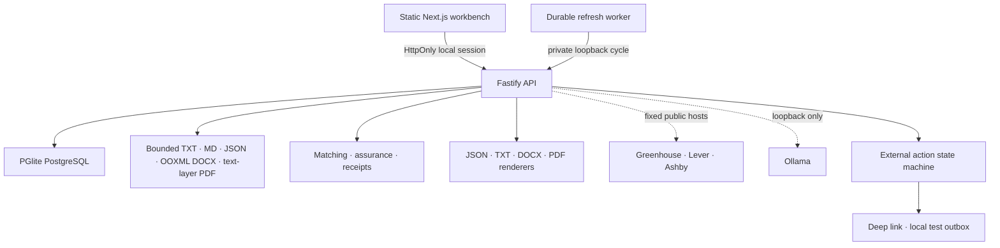
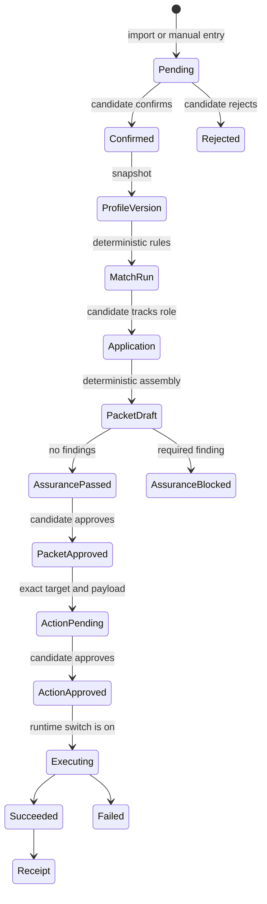

# Nimanto system architecture

## Purpose

Nimanto is a candidate-side evidence and application workbench. Its architecture keeps five trust boundaries explicit:

1. imported material is not confirmed evidence;
2. historical sponsorship evidence is not a current employer promise;
3. a match explanation is not a hiring probability;
4. generated text is not an approved packet;
5. an approved packet is not permission to perform an external action.

## Runtime topology

The website is safe to publish as static files. It does not contain or host a shared candidate backend. A running local API at `127.0.0.1:4310` is required for the workbench.

## Data lifecycle

## Package seams

| Seam                 | Owns                                                                    | Must not own                             |
| -------------------- | ----------------------------------------------------------------------- | ---------------------------------------- |
| `@nimanto/domain`    | Pure matching, assurance, canonical hashes, receipts, state transitions | Network or database access               |
| `@nimanto/database`  | Tenant-scoped persistence and lifecycle operations                      | Provider requests or UI copy             |
| `@nimanto/parsers`   | Bounded text extraction into pending claims                             | Confirmation decisions                   |
| `@nimanto/documents` | Canonical packet rendering and artifact hashes                          | Arbitrary model-authored claims          |
| `@nimanto/providers` | Fixed-host ATS, local model, and mail adapters                          | Approval state                           |
| `@nimanto/api`       | Authentication, orchestration, validation, rate limiting, safe errors   | Employer screening or outcome prediction |
| `@nimanto/web`       | Candidate decisions and explanations                                    | Secrets or direct provider credentials   |

## Persistence

The local beta uses PGlite, which runs PostgreSQL in-process and gives a zero-install local database. The repository boundary uses PostgreSQL SQL and JSONB so a hosted implementation can move to managed PostgreSQL later.

Tenant isolation is enforced in every public repository method and exercised through cross-tenant tests. This is defense in depth for the local beta, not a claim of production PostgreSQL row-level security.

Assurance runs carry a database-generated monotonic sequence. Packet review and
packet approval both resolve the latest run by that sequence, so two runs sharing
the same wall-clock timestamp cannot be reordered by their random IDs. Stored
execution receipts are verified against their canonical hashes on dashboard read;
the workbench exposes those internal hashes without treating them as signatures.

Retained profile, match, packet, and assurance records are exposed through
tenant-scoped, cursor-paginated read seams. The dashboard loads only the latest
match per role and packet per application, plus packets referenced by visible
actions, and the latest assurance per loaded packet; historical pages are
requested only when the candidate opens them. A
cursor is the identifier of a record owned by the same tenant and scope, so a
foreign cursor fails closed. Assurance pages translate the internal global
sequence into an ordinal scoped to one packet and never return the global value.

Profile-version creation is serialized by a tenant-row lock. Confirmed claim IDs
and NFC-trimmed authorization wording are compared with the latest literal
record inside that transaction; unchanged input reuses the latest version. The
client's disabled no-change control is guidance, not the correctness boundary.

Manual role drafts deliberately stay outside persistence. The client holds one
owner-bounded draft above section routing, clears it at authentication and
deletion boundaries, and writes a role only after an explicit successful save.

`nimanto_export_v2` adds complete retained profile-version, match-run, and
assurance-run datasets to the explicit JSON inspection export. It intentionally
omits session and invitation credentials, deletion internals, and generated
packet files. It is not a restore protocol, immutable job-history snapshot, or
execution replay format.

## Authentication

`POST /v1/auth/local` and the explicitly labeled synthetic-demo route are available only on loopback while local mode is enabled and require the high-entropy launch key stored mode `0600`. The local route records the candidate's own name and email. It creates a local tenant, user, membership, and a random 256-bit session token. Only the SHA-256 token hash is stored. The browser receives an HttpOnly, SameSite=Lax cookie.

There is no public hosted sign-up flow. Email-bound, hashed, single-use invitations create isolated local/self-hosted candidate workspaces. Passkeys, managed recovery, production cookie security, and hosted identity remain hosted-beta gates.

## Durable discovery

Candidates can schedule Greenhouse, Lever, and Ashby public-board refreshes from the workbench. Schedules are tenant-owned database records with bounded cadence, a single hashed lease, retry backoff, pause/resume/run-now/cancel controls, and a visible dead-letter state after five consecutive failures. After the network read, each job/match/receipt batch and its recurring-state advance commit in one lease-locked transaction; cancellation before that phase leaves no imported artifacts, and expiry recovery cannot overlap the locked write. A worker cycle claims at most three due schedules through the private bootstrap-authenticated API seam, imports at most 500 roles per source, and publishes deterministic match receipts. Its payload contains provider and board identifiers only; it cannot prepare packets, approve, email, or submit.

## External actions

The database state machine and domain state machine must agree. The API refuses execution unless the action is `approved` and the in-memory runtime switch is on. The switch has no environment override and resets to off with every API restart.

Version 0.4.1 has no connected-account provider. Verification uses only a user-opened deep link and the local test outbox. Gmail, Outlook, form submission, and desktop delivery remain behind the separately approved Slice 4 boundary.

## Scaling path

The next production seam is not another feature. It is a hosted trust layer:

- managed PostgreSQL with row-level security and tested policies;
- WebAuthn/passkeys, invitation lifecycle, and recovery;
- encrypted object storage with short-lived artifact URLs;
- OAuth authorization-code flows with refresh-token protection;
- hosted queue isolation, operational dashboards, and multi-instance worker capacity beyond the local durable lease loop;
- audit-log retention, backup/restore drills, and deletion evidence;
- counsel-reviewed product language and provider terms.

Those gates remain visible so the local beta is not mistaken for a hosted production service.
