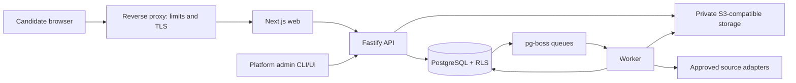
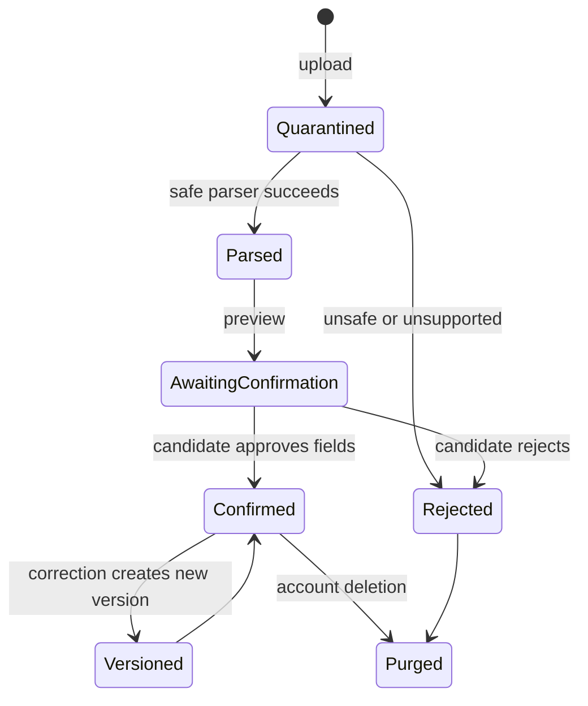

# Nimanto architecture

**Status:** Historical production architecture proposal  
**Snapshot:** 2026-08-05  
**Decision horizon:** Slice 1 in detail; Slices 2–3 as stable seams only

This is the reviewed hosted-production direction, not a description of v0.1.0. See the [implemented system architecture](../architecture/system.md) and [release slice matrix](../releases/v0.1.0-slice-matrix.md) for current behavior.

## Decision summary

Nimanto will be a TypeScript modular monolith: one repository, one PostgreSQL database, one migration history, and separately runnable web, API, and worker processes. This provides workload isolation without creating distributed ownership or cross-service consistency problems.

Next.js owns the accessible web/PWA and minimal Slice-1 demo. Fastify owns the durable JSON API, authentication callbacks, and later webhooks; Next.js itself cautions that its backend-for-frontend support is not a full backend replacement ([Next.js BFF guide](https://nextjs.org/docs/app/guides/backend-for-frontend)). Both support self-hosted Node/Docker deployment ([Next.js self-hosting](https://nextjs.org/docs/app/guides/self-hosting)).

PostgreSQL is the transactional source of truth. Drizzle owns typed schema and reviewed SQL migrations. PostgreSQL Row-Level Security (RLS) and explicit application authorization both enforce tenant boundaries; RLS defaults to deny when enabled without a matching policy, but table owners ordinarily bypass it, so runtime roles must not own tables and tenant tables use `FORCE ROW LEVEL SECURITY` ([PostgreSQL RLS](https://www.postgresql.org/docs/current/ddl-rowsecurity.html), [Drizzle RLS](https://orm.drizzle.team/docs/rls)).

## Proposed version baseline

These are exact planning pins observed from official package registries or project documentation on the snapshot date, not permission to install them. Recheck compatibility, advisories, and release age immediately before implementation; a same-day release may be held back to the most recent supported patch after soak review.

| Component | Proposed pin | Reason / constraint |
|---|---:|---|
| Node.js | 24.19.0 LTS | Production LTS; pg-boss requires Node >=22.12 ([Node releases](https://nodejs.org/en/about/previous-releases), [pg-boss](https://timgit.github.io/pg-boss/)) |
| pnpm / Turborepo | 11.20.0 / 2.10.8 | Workspace and task orchestration only |
| TypeScript | 7.0.2 | One language/toolchain; recheck Next/tooling compatibility before pinning |
| Next.js / React | 16.3.0 / 19.2.8 | Minimal accessible web/PWA |
| Fastify | 5.11.2 | JSON-Schema request validation and response serialization ([Fastify validation](https://fastify.dev/docs/v5.8.x/Reference/Validation-and-Serialization/)) |
| TypeBox provider / TypeBox | 6.1.0 / 1.3.10 | Runtime JSON Schema plus inferred TypeScript types |
| PostgreSQL | 18.4 | Single transactional database and RLS |
| Drizzle ORM / Kit / `pg` | 0.45.2 / 0.31.10 / 8.22.0 | Typed SQL, generated reviewed migrations, node-postgres driver ([Drizzle migrations](https://orm.drizzle.team/docs/migrations)) |
| Better Auth family | 1.6.26 | Drizzle adapter, passkeys, session management; Nimanto retains authorization ownership ([adapter](https://better-auth.com/docs/adapters/drizzle), [passkeys](https://better-auth.com/docs/plugins/passkey)) |
| pg-boss | 12.27.0 | Durable Postgres-backed jobs, transactional enqueue, retries, DLQ, schedules |
| Pino / OpenTelemetry API | 10.3.1 / 1.9.1 | Pino is Slice-1 logging; OpenTelemetry is an interface-only later seam |
| Vitest / Playwright | 4.1.10 / 1.62.1 | Unit/integration and real-browser acceptance tests |
| PDF.js / CSpell | 6.2.108 / 10.0.1 | Slice-1 text-layer extraction and deterministic spelling support |
| axe-core / axe Playwright | 4.13.0 / 4.12.1 | Automated accessibility checks; manual review remains required |
| SeaweedFS | 4.40 candidate | Apache-2.0, S3-compatible local object service; confirm image digest and operational fit before adoption ([release](https://github.com/seaweedfs/seaweedfs/releases/tag/4.40)) |
| Caddy | 2.11.4 candidate | Apache-2.0 reverse proxy/TLS; confirm digest and self-host certificate workflow ([release](https://github.com/caddyserver/caddy/releases/tag/v2.11.4)) |
| fflate / saxes | 0.8.3 / 6.0.0 | MIT/ISC OOXML ZIP/XML extraction with explicit supported-construct limits |

Cloudflare R2 is an optional hosted S3 adapter, not a required dependency. Its Standard tier currently includes 10 GB-month, 1M Class A and 10M Class B operations monthly; usage above those units is billed ([R2 pricing](https://developers.cloudflare.com/r2/pricing/)).

## Repository and dependency direction

```text
apps/
  web/        # Next.js demo/PWA; calls API contracts
  api/        # Fastify composition root
  worker/     # pg-boss composition root
packages/
  domain/     # entities, policies, state machines; no framework imports
  contracts/  # versioned JSON Schemas, OpenAPI assembly, error envelopes
  database/   # Drizzle schema, migrations, RLS and transaction helpers
  auth/       # Better Auth adapter plus Nimanto authorization policies
  evidence/   # import, source locators, confirmation and vault use cases
  jobs/       # posting snapshots, adapters, provenance and deduplication
  matching/   # deterministic features, bands and explanations
  receipts/   # canonical event/receipt material and hashes
  storage/    # private-object port plus S3 adapter
  observability/ # allowlisted events, metrics and redaction
  datasets/   # edition/checksum-addressed government-evidence port; Slice 2 implementation
  model-gateway/ # provider-neutral model port; Slice 3 implementation
  documents/  # canonical document and renderer ports; Slice 3 implementation
  test-kit/   # synthetic fixtures and tenant-adversarial helpers
```

Dependencies point inward: apps and adapters depend on domain/contracts; domain imports no Next.js, Fastify, Drizzle, Better Auth, pg-boss, storage, model, or Tauri SDK. Route and worker handlers authenticate, validate, open a tenant-scoped transaction, call one use case, and serialize a contract. No business rule lives in React components, controllers, ORM models, or queue handlers.

## Deployment and trust boundaries



Caddy terminates TLS and enforces request/body/time/rate limits; its exact certificate workflow and image digest are implementation-time gates. The web process never receives database or object-store credentials. API and worker use separate least-privilege database roles; neither is a table owner, superuser, or `BYPASSRLS` role. Storage is private. Browsers use an app-proxied stream with a single-use, two-minute capability bound to actor, method, object and version; storage URLs/keys are never exposed.

## Tenancy, invitations, and bootstrap

Slice 1 uses **one candidate per tenant**. An accepted beta invitation creates a new tenant and makes that candidate its owner. Joining or sharing an existing candidate tenant is unsupported, which avoids a collaboration model before vault-sharing consent and authorization are designed.

Only a `platform_admin`, represented outside tenant membership, can issue or revoke invites. An invitation stores only a random-token hash, intended email, issuer, creation/expiry, use/revocation timestamps, and one-use nonce. It expires after 72 hours, is single-use, and cannot be converted to another email. Acceptance is transactional: consume invite, create user, tenant and membership, register the first passkey, then create a session or roll everything back. Public signup stays disabled.

The first platform admin is created by a one-shot local CLI command that works only when zero platform admins exist, requires an interactive confirmation plus an out-of-band bootstrap secret, and records a security event. The raw secret is never stored; it is removed after use. Hosted operators cannot inspect candidate tenant content through the admin role. Impersonation is disabled.

## Domain model

| Aggregate | Ownership and relationships |
|---|---|
| Access | `PlatformAdmin` issues `Invitation`; acceptance creates `User`, single-candidate `Tenant`, owner `Membership`, `Passkey`, `RecoveryCode`, and `Session`. PlatformAdmin is never a tenant member by default |
| Evidence | Tenant owns `EvidenceSource`; it yields versioned `Claim` records with locators. Confirmed claims plus manual `Preference` and locked `AuthorizationWording` form immutable `ProfileVersion`; corrections supersede rather than mutate |
| Job catalog | Platform owns versioned `SourceApproval` (domain/provider, terms/data-rights and applicable robots review, approver/date, allowed uses, kill switch). Tenant `SourcePolicy` may only narrow its sources/budgets; tenant owns snapshots, versions, postings, duplicate links and tombstones |
| Matching | `MatchRun` freezes profile/job/rule input hashes and owns `Feature` and `Explanation`; published runs never mutate |
| Application lifecycle | `Application` links one Posting and frozen ProfileVersion; it owns `Artifact`, `AssuranceRun`, `Finding`, `Approval`, and append-only user-recorded `Outcome` events. No external-send capability exists before Slice 4 |
| Operations | `Receipt` references deterministic input/artifact hashes plus execution events; `ExportRun` inventories tenant data; `DeletionRun` locks and purges the entire tenant graph |

Slices 2–3 fill stable ports in `datasets`, `model-gateway`, and `documents`; they do not move authorization, scoring, evidence, approval, or lifecycle policy out of domain.

## Data lifecycle



Objects first receive a DB ownership row and quarantine key. Parsers consume immutable content by hash in an isolated worker. Structured facts carry tenant, source object, page/section/character locator, parser/version, confidence, and confirmation status. Only confirmed facts are visible to matching. A correction creates a new profile version; it never rewrites an evidence history entry in place.

Job postings store immutable raw snapshots plus normalized versions. The contract includes tenant/source-policy IDs; provider/source job ID; canonical or private source URL; raw employer plus resolved employer/confidence; title; description; locations/work mode; compensation min/max/currency/period and stated benefits; source-posted/updated/retrieved timestamps; first/last seen; expiry/status; raw/normalized hashes; retrieval method; parser/normalizer versions; rights/retention policy; and duplicate lineage.

Exact dedupe keys are provider + stable job ID, then reviewed canonical URL + content hash. Fuzzy employer/title/location similarity only proposes a `DuplicateLink`; it never silently merges. After review, first-party provider fields with the newest source timestamp are preferred, manual tenant corrections are overlays, all conflicts remain addressable by source, and reversible `merged_into` lineage retains every original version.

## Contracts and use cases

JSON Schema is the wire source of truth for HTTP bodies, responses, queue payloads, stored snapshots, and structured model output. Fastify compiles only trusted application schemas; user-supplied schemas are forbidden because Fastify/Ajv compilation treats schemas as code. OpenAPI is generated from the same versioned contracts.

Initial API surface:

| Area | Commands / queries |
|---|---|
| Access | issue/revoke/accept invitation; register/authenticate passkey; revoke session; reauthenticate |
| Evidence | create upload intent; extract file metadata; inspect preview; confirm/reject/correct claim; manually add employment, education, projects, certifications, accomplishments, skills, preferences, approved authorization wording, and GitHub/portfolio URL-backed evidence; list versions |
| Jobs | ingest manual text/file; refresh Greenhouse board; list snapshot/provenance; mark stale |
| Matching | request run; get band/components/evidence/exclusions; compare rule versions |
| Applications/outcomes (Slice 2) | create manual application record; append reply/screen/interview/offer/rejection/withdrawal outcome; report personal funnel by role/source/band with sample size/window |
| Preparation (Slice 3) | prepare to approval queue; run assurance; approve/reject/invalidate frozen artifact; never send |
| Data rights | export tenant; request/cancel deletion; read deletion status; exchange single-purpose deletion-status token |
| Receipts | get tenant-authorized receipt by immutable ID |

Commands/events use a versioned envelope: `schema_version`, `type`, `message_id`, trusted `tenant_id`, `actor_id`, `occurred_at`, `causation_id`, `correlation_id`, `idempotency_key`, `expected_aggregate_version`, and `payload_hash`. Jobs add `not_before`, `expires_at`, attempt policy and identifier-only payload. The API opens an explicit transaction and uses `SET LOCAL` for tenant/actor context used by RLS. PostgreSQL resets it at transaction end; session-level tenant settings are forbidden, including behind a pooler. The use case authorizes, writes state/event material, and transactionally enqueues. Workers re-establish tenant context, re-check current authorization/state, and claim an inbox key before effects.

pg-boss delivery does not make external side effects exactly once. Internal work is idempotent; later external effects require an attempt ledger, provider receipt, ambiguous-outcome reconciliation, and kill switch. RFC 8785, NFC-normalized strings, integers rather than floats, versioned schemas, and SHA-256 produce a stable `input_hash` for normalized inputs/rules and `artifact_hash` for frozen outputs. A `receipt_hash` covers the full execution receipt—including run ID, timestamps, approvals and outcomes—and is intentionally unique while linking those stable hashes.

## State machines and errors

| Machine | Allowed transitions and guards |
|---|---|
| Invitation | `issued -> accepted | revoked | expired`; only issued/unexpired/unrevoked may accept, exactly once |
| Evidence/Profile | `quarantined -> parsed -> awaiting_confirmation -> confirmed | rejected`; confirmed claims form `active ProfileVersion -> superseded | purged`; published versions never edit in place |
| Job | `discovered -> active -> stale -> expired | tombstoned`; refresh creates version; reviewed duplicate link may `merge -> unmerge`; sources are retained |
| Match | `requested -> running -> published | failed`; frozen profile/job/rule hashes required; failed run never publishes partial score |
| Application/Outcome | `tracked -> prepared -> approved_for_export | withdrawn`; user may record `submitted_externally`; outcomes append `reply | screen | interview | offer | rejection`; no state sends externally |
| Assurance/Approval | `queued -> running -> passed | blocked | quarantined`; `pending -> approved | rejected | invalidated`; artifact edit always invalidates approval |
| Export | `requested -> running -> ready | failed -> retrying`; ready exports expire; foreign/cross-version access denied |
| Deletion | `requested -> locked -> purging -> backups_suppressed -> complete`; `requested|locked -> cancelled` after reauth only; `purging -> failed -> purging` is resumable and cancellation is forbidden after purge begins |

Invalid transitions return a stable conflict rather than being coerced. Scheduled Slice-2 jobs may discover, refresh, dedupe and score; Slice-3 jobs may prepare only into the approval queue. Schedules never email, submit, or create standing approval.

Error envelopes contain `code`, safe `message`, `request_id`, optional field paths, retryability, and documentation URI. External classes are: `AUTHENTICATION_REQUIRED` (401), `NOT_FOUND` (404 for absent or unauthorized tenant resources), `VALIDATION_FAILED` (400/422), `STATE_CONFLICT`/`IDEMPOTENCY_CONFLICT` (409), `RATE_LIMITED` (429), `DEPENDENCY_UNAVAILABLE` (503), `UNSAFE_CONTENT` (422), and `INTERNAL` (500). The internal event may record authorization denial; the response never reveals it. Raw parser/provider/database errors and sensitive fields never cross the boundary.

## Architecture decisions and deferrals

1. **Modular monolith:** smallest design that preserves deep domain seams; microservices are rejected.
2. **Fastify application API:** keeps durable rules out of the web framework.
3. **PostgreSQL plus RLS and application authorization:** defense in depth, tested with malicious tenants.
4. **Single-candidate tenant:** avoids premature sharing; platform admin is not a vault member.
5. **Deterministic scoring:** models propose facts but cannot alter bands.
6. **S3 storage port:** SeaweedFS local and R2 hosted remain replaceable adapters.
7. **Postgres queue:** avoids Redis while preserving transactional work creation.
8. **No vector store:** normalized evidence and PostgreSQL search establish the baseline.
9. **No Python in Slice 1:** introduce it only behind a measured, stable port.
10. **Deferred:** email, submission, contact discovery, Tauri, updater, fully offline desktop, cryptographic receipt signing, and multi-member tenants.
